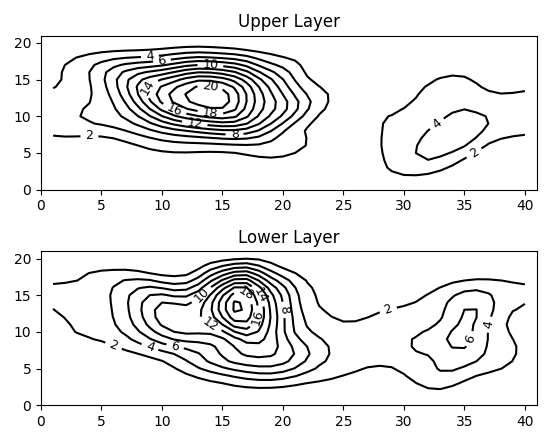
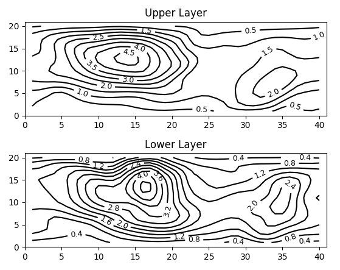

<link rel="shortcut icon" href="favicon.bmp" />

<head><title>Benjamin Menetrier | OOPS training</title></head>

[Home](index) | [Research](research) | [Publications](publications) | [Documentation](documentation) | [Communications](communications) | [Teaching](teaching) | **OOPS training** | [Contact](contact)

# OOPS training

* [Prerequisite - OOPS installation](#oops_installation)
* [Part A - compute variance](#oops_variance)
* [Part B - compute standard-deviation](#oops_stddev)
* [Part C - add unit test](#oops_unit_test)

<a name="oops_installation"></a>

## OOPS installation

### Requirements

Some libraries are required to compile OOPS:
* git
* cmake
* netcdf
* eigen

### ECBUILD installation

If you don't have `ecbuild` installed on your machine, you can run the following script. First, edit the directories:

* `SOURCE_DIR`
* `BUILD_DIR`
* `INSTALL_DIR`

```shell
#!/usr/bin/env bash

############################################################

# Source directory where the code will be cloned from github
SOURCE_DIR=${HOME}/code

# Build directory
BUILD_DIR=${HOME}/build

# Install directory
INSTALL_DIR=${HOME}/install

############################################################

# Cloning ECBUILD
mkdir -p ${SOURCE_DIR}
cd ${SOURCE_DIR}
git clone git@github.com:ecmwf/ecbuild.git

# Installing ECBUILD
mkdir -p ${BUILD_DIR}/ecbuild
mkdir -p ${INSTALL_DIR}/ecbuild
cd ${BUILD_DIR}/ecbuild
cmake -DCMAKE_INSTALL_PREFIX=${INSTALL_DIR}/ecbuild ${SOURCE_DIR}/ecbuild
make install

# Add ECBUILD to PATH (add this to your .bashrc or .bash_profile)
export PATH=${PATH}:${INSTALL_DIR}/ecbuild/bin
```

### OOPS bundle installation

To install the OOPS bundle, run the following script. First, edit the directories:

* `SOURCE_DIR`
* `BUILD_DIR`
* `INSTALL_DIR`

```shell
#!/usr/bin/env bash

############################################################

# Source directory where the code will be cloned from github
SOURCE_DIR=${HOME}/code

# Build directory
BUILD_DIR=${HOME}/build

# Install directory
INSTALL_DIR=${HOME}/install

############################################################

# Creating OOPS tutorial bundle
mkdir -p ${SOURCE_DIR}/oops_tutorial
cat <<EOF > ${SOURCE_DIR}/oops_tutorial/CMakeLists.txt
cmake_minimum_required( VERSION 3.12 FATAL_ERROR )

find_package( ecbuild 3.6 REQUIRED HINTS ${CMAKE_CURRENT_SOURCE_DIR} ${CMAKE_CURRENT_SOURCE_DIR}/../ecbuild)

project( oops-bundle VERSION 0.0.1 LANGUAGES C CXX Fortran )

list(APPEND CMAKE_MODULE_PATH "${CMAKE_CURRENT_SOURCE_DIR}/cmake")

include( ecbuild_bundle )

# Default release mode
set( ECBUILD_DEFAULT_BUILD_TYPE Release )

# Enable OpenMP and MPI
set( ENABLE_MPI ON CACHE BOOL "Compile with MPI" )
set( ENABLE_OMP ON CACHE BOOL "Compile with OpenMP" )
set( ENABLE_CUDA OFF CACHE BOOL "CUDA toolkit" )

# Define bundle
ecbuild_bundle_initialize()

# Add the automatically determined parts of the RPATH
# which point to directories outside the build tree to the install RPATH
set(CMAKE_INSTALL_RPATH_USE_LINK_PATH ON)

# when building, already use the install RPATH
set(CMAKE_BUILD_WITH_INSTALL_RPATH ON)

# ECMWF tools
ecbuild_bundle( PROJECT eckit GIT "git@github.com:ecmwf/eckit.git" TAG 1.24.4 )
ecbuild_bundle( PROJECT fckit GIT "git@github.com:ecmwf/fckit.git" TAG 0.11.0 )
ecbuild_bundle( PROJECT atlas GIT "git@github.com:ecmwf/atlas.git" TAG 0.37.0 )

# OOPS
ecbuild_bundle( PROJECT oops  GIT "git@github.com:benjaminmenetrier/oops.git" BRANCH develop )

ecbuild_bundle_finalize()
EOF

# Installing OOPS bundle
mkdir -p ${BUILD_DIR}/oops_tutorial
cd ${BUILD_DIR}/oops_tutorial
ecbuild ${SOURCE_DIR}/oops_tutorial

# Compiling OOPS only
cd ${BUILD_DIR}/oops_tutorial/oops
make -j4

# Testing OOPS
cd ${BUILD_DIR}/oops_tutorial/oops
ctest
```

<a name="oops_variance"></a>

## Step-by-step instructions to compute ensemble variance

The goal of this first part is to build a new OOPS application for the QG model that can compute and write the variance of an ensemble.

### Prerequisites

Please run the installation instruction of [OOPS installation](teaching_oops_installation) and change the OOPS branch:

```shell
cd ${SOURCE_DIR}/oops_tutorial/oops
git pull
git checkout feature/oops_tutorial_part_A
```

Update `${SOURCE_DIR}/oops_tutorial/CMakeLists.txt` by replacing the line:

```cmake
ecbuild_bundle( PROJECT oops  GIT "git@github.com:benjaminmenetrier/oops.git" BRANCH develop )
```

with

```cmake
ecbuild_bundle( PROJECT oops  GIT "git@github.com:benjaminmenetrier/oops.git" BRANCH feature/oops_tutorial_part_A )
```

### Create an (empty) OOPS application

Create a file `oops/src/oops/runs/EnsembleStdDev.h`:

```cpp
#pragma once

// INCLUDES
#include <string>
#include "oops/runs/Application.h"
#include "util/Logger.h"

namespace oops {

template <typename MODEL>
class EnsembleStdDev : public oops::Application {
  // ALIASES

 public:
  // -----------------------------------------------------------------------------
  EnsembleStdDev() {}
  // -----------------------------------------------------------------------------
  virtual ~EnsembleStdDev() {}
  // -----------------------------------------------------------------------------
  int execute(const eckit::Configuration& fullConfig) const {
    Log::info() << "EnsembleStdDev starting" << std::endl;

    // CODE

    Log::info() << "EnsembleStdDev done" << std::endl;

    return 0;
  }
  // -----------------------------------------------------------------------------
 private:
  std::string appname() const {
    return "oops::EnsembleStdDev<" + MODEL::name() + ">";
  }
  // -----------------------------------------------------------------------------
};

}  // namespace oops
```

We will fill the `INCLUDES`, `ALIASES` and `CODE` sections progressively.

### Add the new application in CMakeLists.txt

To compile the new application, add it in `oops/src/CMakeLists.txt` at line 238:

```cmake
oops/runs/EnsembleStdDev.h
```

### Create the QG-specific application

Create the file `oops/qg/mains/qgEnsembleStdDev.cc`

```cpp
#include "model/QgTraits.h"
#include "model/LogbookQG.h"
#include "oops/runs/EnsembleStdDev.h"
#include "oops/runs/Run.h"

int main(int argc,  char ** argv) {
  oops::Run run(argc, argv);
  oops::EnsembleStdDev<qg::QgTraits> esd;
  qg::LogbookQG::start();
  run.execute(esd);
  qg::LogbookQG::stop();
  return 0;
};
```

### Add the new QG application in CMakeLists.txt

To compile the new QG application, add it in `oops/qg/mains/CMakeLists.txt` at line 38:

```cmake
ecbuild_add_executable( TARGET  qg_ensemble_std_dev.x
                        SOURCES qgEnsembleStdDev.cc
                        LIBS    qg
                      )
```

### Add a new test without comparison

To run our new (empty) application, the easiest way is to add a test. However, we don't want to compare the results with a reference file yet. So we create a temporary test without comparison, just to check the tutorial steps one by one. In `oops/qg/test/CMakeLists.txt`, add the following code at line 514:

```cmake
ecbuild_add_test( TARGET test_qg_ensemble_std_dev_nocmp
                  TYPE SCRIPT
                  COMMAND "${CMAKE_BINARY_DIR}/bin/qg_ensemble_std_dev.x"
                  ARGS testinput/ensemble_std_dev.json
                  DEPENDS qg_ensemble_std_dev.x )
```

### Create an (empty) input json file

We start with an empty input json file, which we will fill progressively along the steps. Create a new file `oops/qg/test/testinput/ensemble_std_dev.json`:

```json
{}
```

### Add the new input json file in CMakeLists.txt

Add the new input json file in `oops/qg/test/CMakeLists.txt` at line 36:

```cmake
  testinput/ensemble_std_dev.json
```

### Re-compile and run QG tests

We assume that the prerequisite are met, so the `BUILD_DIR` environment variable is already set. Type in the terminal:

```shell
cd ${BUILD_DIR}/oops_tutorial/oops/qg
make -j4
```

You should notice that the configuration step is re-run automatically before the compilation step. This is because we have touched some `CMakeLists.txt` files. Run the QG tests:

```shell
ctest
```

All tests should pass.

### Run the new test in verbose mode

To run the new test in verbose mode, type:

```shell
ctest -VV -R test_qg_ensemble_std_dev_nocmp
```

Notice in the output:

* The test command:
```
Test command: ${BUILD_DIR}/oops_tutorial/bin/qg_ensemble_std_dev.x "testinput/ensemble_std_dev.json"
```
* The input configuration file:
```
Configuration input file is: testinput/ensemble_std_dev.json
```
* The input configuration content:
```
Full configuration is:YAMLConfiguration[path=testinput/ensemble_std_dev.json, root={}]
```

So far, the application itself only prints:

```
EnsembleStdDev starting
EnsembleStdDev done
```

### Create a geometry object in the application

To create a geometry object in the application, open `oops/src/oops/runs/EnsembleStdDev.h` and:

* Add in the `INCLUDES` section:
```cpp
#include "oops/interface/Geometry.h"
```
* Add in the `ALIASES` section:
```cpp
  using Geometry_ = oops::Geometry<MODEL>;
```
* Add in the `CODE` section:
```cpp
    // Setup resolution
    const eckit::LocalConfiguration resolConfig(fullConfig, "resolution");
    const Geometry_ resol(resolConfig);
    Log::info() << "Geometry created: " << resol << std::endl;
```

### Add geometry setup in the input json file

Add in the input json file `oops/qg/test/testinput/ensemble_std_dev.json`:

```json
  "resolution": {
    "nx": "40",
    "ny": "20",
    "bc": "1"
  },
```

### Check geometry content

Re-compile and run in verbose mode:

```shell
cd ${BUILD_DIR}/oops_tutorial/oops/qg
make -j4
ctest -VV -R test_qg_ensemble_std_dev_nocmp
```

The geometry content is now printed in the output:

```
58: Geometry created: nx = 40, ny = 20
```

### Create a model object in the application

To create a model object in the application, open `oops/src/oops/runs/EnsembleStdDev.h` and:

* Add in the `INCLUDES` section:
```cpp
#include "oops/interface/Model.h"
```
* Add in the `ALIASES` section:
```cpp
  using Model_ = oops::Model<MODEL>;
```
* Add in the `CODE` section:
```cpp
    // Setup model
    const eckit::LocalConfiguration modelConfig(fullConfig, "model");
    const Model_ model(resol, modelConfig);
    Log::info() << "Model created: " << model << std::endl;
```

### Add model setup in the input json file

Add in the input json file `oops/qg/test/testinput/ensemble_std_dev.json`:

```json
  "model": {
    "tstep": "PT1H",
    "top_layer_depth": "5500.0",
    "bottom_layer_depth": "4500.0"
  }
```

**Important:** don't forget to add a comma at the end of the `geometry` section before adding the `model` section.

### Check model content

Re-compile and run in verbose mode, look at the model content in the output:

```
58:  c_qg_setup: nx, ny=          40          20
58:  c_qg_setup: d1, d2=   5500.0000000000000        4500.0000000000000
58:  c_qg_setup: dt0=   3600.0000000000000
58: Model created: ModelQG::print not implemented
```

### Read the background in the application

To read the background in the application, open `oops/src/oops/runs/EnsembleStdDev.h` and:

* Add in the `INCLUDES` section:
```cpp
#include "oops/interface/State.h"
```
* Add in the `ALIASES` section:
```cpp
  using State_ = oops::State<MODEL>;
```
* Add in the `CODE` section:
```cpp
    // Setup background
    const eckit::LocalConfiguration bkgConfig(fullConfig, "background");
    const State_ xb(resol, model, bkgConfig);
    Log::info() << "Background created: " << xb << std::endl;
```

### Add background setup in the input json file

Add in the input json file`oops/qg/test/testinput/ensemble_std_dev.json`:

```json
  "background": {
    "filename": "Data/example.fc.2009-12-31T00:00:00Z.P1D",
    "date": "2010-01-01T00:00:00Z"
```

**Important:** don't forget to add a comma at the end of the `model` section before adding the `background` section.

### Check background content

Re-compile and run in verbose mode, look at the background content in the output:

```
58:  qg_field:read_file: opening Data/example.fc.2009-12-31T00:00:00Z.P1D
58:  validity date is: 2010-01-01T00:00:00Z
58: Background created: 
58:   Valid time: 2010-01-01T00:00:00Z
58:   Resolution = 40, 20, Fields = 1, 2
58:   Min=-27.7757, Max=10.5671, RMS=11.6447
58:   Min=-25.2, Max=0, RMS=12.9878
58:   Min=-42.4306, Max=36.45, RMS=28.1071
```

### Setup and read the ensemble in the application

To setup and read the ensemble in the application, open `oops/src/oops/runs/EnsembleStdDev.h` and:

* Add in the `INCLUDES` section:
```cpp
#include "oops/base/Ensemble.h"
```
* Add in the `ALIASES` section:
```cpp
  using Ensemble_ = oops::Ensemble<MODEL>;
```
* Add in the `CODE` section:
```cpp
    // Setup ensemble
    const eckit::LocalConfiguration ensConfig(fullConfig, "ensemble");
    Ensemble_ ens(xb.validTime(), ensConfig);
    Log::info() << "Ensemble created with size " << ens.size() << std::endl;

    // Read ensemble
    ens.linearize(xb, resol);
    Log::info() << "Ensemble linearized" << std::endl;
```

### Add ensemble setup in the input json file

Add in the input json file `oops/qg/test/testinput/ensemble_std_dev.json`:

```json
  "ensemble": {
    "members": "10",
    "variables": "ci",
    "state": [
      {
        "filename": "Data/test.ens.1.2009-12-31T00:00:00Z.P1D",
        "date": "2010-01-01T00:00:00Z"
      },
      {
        "filename": "Data/test.ens.2.2009-12-31T00:00:00Z.P1D",
        "date": "2010-01-01T00:00:00Z"
      },
      {
        "filename": "Data/test.ens.3.2009-12-31T00:00:00Z.P1D",
        "date": "2010-01-01T00:00:00Z"
      },
      {
        "filename": "Data/test.ens.4.2009-12-31T00:00:00Z.P1D",
        "date": "2010-01-01T00:00:00Z"
      },
      {
        "filename": "Data/test.ens.5.2009-12-31T00:00:00Z.P1D",
        "date": "2010-01-01T00:00:00Z"
      },
      {
        "filename": "Data/test.ens.6.2009-12-31T00:00:00Z.P1D",
        "date": "2010-01-01T00:00:00Z"
      },
      {
        "filename": "Data/test.ens.7.2009-12-31T00:00:00Z.P1D",
        "date": "2010-01-01T00:00:00Z"
      },
      {
        "filename": "Data/test.ens.8.2009-12-31T00:00:00Z.P1D",
        "date": "2010-01-01T00:00:00Z"
      },
      {
        "filename": "Data/test.ens.9.2009-12-31T00:00:00Z.P1D",
        "date": "2010-01-01T00:00:00Z"
      },
      {
        "filename": "Data/test.ens.10.2009-12-31T00:00:00Z.P1D",
        "date": "2010-01-01T00:00:00Z"
      }
    ]
  }
```

**Important:** don't forget to add a comma at the end of the `background` section before adding the `ensemble` section.

### Check background content

Re-compile and run in verbose mode, look at the ensemble content in the
output:

```
58: Ensemble created with size 10
58:  qg_field:read_file: opening Data/test.ens.1.2009-12-31T00:00:00Z.P1D
58:  validity date is: 2010-01-01T00:00:00Z
58:  qg_field:read_file: opening Data/test.ens.2.2009-12-31T00:00:00Z.P1D
58:  validity date is: 2010-01-01T00:00:00Z
58:  qg_field:read_file: opening Data/test.ens.3.2009-12-31T00:00:00Z.P1D
58:  validity date is: 2010-01-01T00:00:00Z
58:  qg_field:read_file: opening Data/test.ens.4.2009-12-31T00:00:00Z.P1D
58:  validity date is: 2010-01-01T00:00:00Z
58:  qg_field:read_file: opening Data/test.ens.5.2009-12-31T00:00:00Z.P1D
58:  validity date is: 2010-01-01T00:00:00Z
58:  qg_field:read_file: opening Data/test.ens.6.2009-12-31T00:00:00Z.P1D
58:  validity date is: 2010-01-01T00:00:00Z
58:  qg_field:read_file: opening Data/test.ens.7.2009-12-31T00:00:00Z.P1D
58:  validity date is: 2010-01-01T00:00:00Z
58:  qg_field:read_file: opening Data/test.ens.8.2009-12-31T00:00:00Z.P1D
58:  validity date is: 2010-01-01T00:00:00Z
58:  qg_field:read_file: opening Data/test.ens.9.2009-12-31T00:00:00Z.P1D
58:  validity date is: 2010-01-01T00:00:00Z
58:  qg_field:read_file: opening Data/test.ens.10.2009-12-31T00:00:00Z.P1D
58:  validity date is: 2010-01-01T00:00:00Z
58: Ensemble.to_perturbations with inflation :1
58: Ensemble linearized
```

### Compute and write the variance in the application

To compute and write the variance in the application, open `oops/src/oops/runs/EnsembleStdDev.h` and:

* Add in the `INCLUDES` section:
```cpp
#include "oops/interface/Increment.h"
```
* Add in the `ALIASES` section:
```cpp
  using Increment_ = oops::Increment<MODEL>;
```
* Add in the `CODE` section:
```cpp
    // Compute variance
    const Increment_ var = ens.variance();
    Log::test() << "Variance: " << var << std::endl;

    // Write variance
    const eckit::LocalConfiguration varConfig(fullConfig, "variance");
    var.write(varConfig);
```

### Add variance output in the input json file

Add in the input json file `oops/qg/test/testinput/ensemble_std_dev.json`:

```json
  "variance": {
    "datadir": "Data",
    "exp": "variance",
    "type": "inc",
    "date": "2010-01-01T00:00:00Z"
  }
```

**Important:** don't forget to add a comma at the end of the `ensemble` section before adding the `variance` section.

### Check variance content

Re-compile and run in verbose mode, look at the variance content in the output:

```
58: Test     : Variance: 
58: Test     :   Valid time: 2010-01-01T00:00:00Z
58: Test     :   Resolution = 40, 20, Fields = 1, 0
58: Test     :   Min=0.0101586, Max=21.8347, RMS=5.61818
58: LogbookQG::update done: LocalConfiguration[root={IncrementWriting_active => true , IncrementWriting => true}]
58: 
58:  qg_field:write_file: writing Data/variance.inc.2010-01-01T00:00:00Z
58: LogbookQG::update done: LocalConfiguration[root={IncrementWriting_active => false , IncrementWriting => true}]
```

### Plot the variance field

We can plot the variance field to check it is reasonable. Create the script `oops/qg/scripts/plotVariance.py` with the following code (edit the `datadir` variable):

```python
import numpy as np
import matplotlib.pyplot as plt
import matplotlib.cm as cm

# Choose data directory
datadir="${BUILD_DIR}/oops_tutorial/oops/qg/test/Data/"

# Define file name
filename = datadir + "/variance.inc.2010-01-01T00:00:00Z"

# Read file
infile = open(filename,"r")
[nx, ny, nl, nf, ns] = [int(i) for i in infile.readline().split()]
validity_date = infile.readline().rstrip()
psi = np.fromfile(file=infile,dtype="float64", count=(2*ny*nx),sep=" ").reshape((2,ny,nx))
infile.close()

# Print fields info
print("Grid dimensions are: nx=" + str(nx) + " ny=" + str(ny))
print("Validity date is: " + validity_date)
print("Variance min=" + str(np.amin(psi)) + " / max=" + str(np.amax(psi)))

# Plot fields
x = np.arange(1,nx+1)
y = np.arange(1,ny+1)
plt.figure()

# Upper plot
ax = plt.subplot(2,1,1)
ax.set_autoscale_on(False)
plt.axis([0, nx+1, 0, ny+1])
plt.title("Upper Layer")
CSPSI = plt.contour(x,y,psi[0,:,:],10,colors='k')
plt.clabel(CSPSI, fontsize=9, inline=1)

# Lower plot
bx = plt.subplot(2,1,2)
bx.set_autoscale_on(False)
plt.axis([0, nx+1, 0, ny+1])
plt.title("Lower Layer")
CSPSI = plt.contour(x,y,psi[1,:,:],10,colors='k')
plt.clabel(CSPSI, fontsize=9, inline=1)

# Show plot
plt.show()
```

and run the script:

```shell
python3 ${SOURCE_DIR}/oops_tutorial/oops/qg/scripts/plotVariance.py
```

We can check that values are positive:



### Solution

To obtain a summary of all the changes, type:

```shell
cd ${SOURCE_DIR}/oops_tutorial/oops
git diff feature/oops_tutorial_part_A feature/oops_tutorial_part_B
```

<a name="oops_stddev"></a>

## Step-by-step instructions to compute ensemble standard-deviation

The goal of this second part is to compute and write the standard-deviation of an ensemble. For this, we will start from the outcome on the first part and add a new capability to the increment object: taking its own square-root.

### Prerequisites

If you have completed the part 2 successfully, you can skip this and continue.

If you start from here, please run the installation instructions of [OOPS installation](teaching_oops_installation) and change the OOPS branch:

```shell
cd ${SOURCE_DIR}/oops_tutorial/oops
git checkout feature/oops_tutorial_part_B
```

Update `${SOURCE_DIR}/oops_tutorial/CMakeLists.txt` by replacing the line:

```cmake
ecbuild_bundle( PROJECT oops  GIT "git@github.com:benjaminmenetrier/oops.git" BRANCH develop )
```

with

```cmake
ecbuild_bundle( PROJECT oops  GIT "git@github.com:benjaminmenetrier/oops.git" BRANCH feature/oops_tutorial_part_B )
```

### Compute and write the standard-deviation in the application

To compute and write the standard-deviation in the application, open `oops/src/oops/runs/EnsembleStdDev.h` and add in the `// CODE` section:

```cpp
    // Compute standard-deviation
    Increment_ stdDev(var);
    stdDev.square_root();
    Log::test() << "Standard-deviation: " << stdDev << std::endl;

    // Write standard-deviation
    const eckit::LocalConfiguration stdDevConfig(fullConfig, "standard-deviation");
    stdDev.write(stdDevConfig);
```

### Add standard-deviation output in the input json file

Add in the input json file `oops/qg/test/testinput/ensemble_std_dev.json`:

```json
  "standard-deviation": {
    "datadir": "Data",
    "exp": "stddev",
    "type": "inc",
    "date": "2010-01-01T00:00:00Z"
  }
```

**Important:** don't forget to add a comma at the end of the `variance` section before adding the `standard-deviation` section.

### Compilation error

We can try to compile the code as is:

```shell
cd ${BUILD_DIR}/oops_tutorial/oops/qg
make -j4
```

The compilation fails because the `square_root()` method does not exist yet... We need to implement it!

### Add `square_root()` method in the `Increment` abstract class

We start by adding the method in the `Increment` abstract class. Open `oops/src/oops/interface/Increment.h` and add at line 119:

```cpp
  /// Square-root
  void square_root();
```

Add also at line 369:

```cpp
template <typename MODEL>
void Increment<MODEL>::square_root() {
  Log::trace() << "Increment<MODEL>::square_root starting" << std::endl;
  util::Timer timer(classname(), "square_root");
  increment_->square_root();
  Log::trace() << "Increment<MODEL>::square_root done" << std::endl;
}

// -----------------------------------------------------------------------------
```

Now, the `square_root()` method is called for the `increment_` object, which is an instantiation of the increment for a specific model (QG model in our case).

### Add `square_root()` method in the `IncrementQG` class

To implement the `square_root()` method in the `IncrementQG` class, add in `oops/qg/model/IncrementQG.h` at line 175:

```cpp
  void square_root();
```

and add in `oops/qg/model/IncrementQG.cc` at line 162:

```cpp
void IncrementQG::square_root() {
  fields_->square_root();
}
// -----------------------------------------------------------------------------
```

To avoid code duplication, both the `IncrementQG` and the `StateQG` classes use the `FieldsQG` class, which does not corresponds to an abstract OOPS class but is "internal" to the QG model.

### Add `square_root()` method in the `FieldsQG` class

To implement the `square_root()` method in the `FieldsQG` class, add in `oops/qg/model/FieldsQG.h` at line 66:

```cpp
  void square_root();
```

and add in `oops/qg/model/IncrementQG.cc` at line 134:

```cpp
void FieldsQG::square_root() {
  qg_field_square_root_f90(keyFlds_);
  fset_.clear();
}
// -----------------------------------------------------------------------------
```

Here comes the tricky part... `qg_field_square_root_f90` is actually a call to the C interface of a Fortran function. `keyFlds_` is the integer identifying an instance of the `qg_field` derived type in the `qg_fields_mod` module.

### Add C/Fortran interface declaration

First, we need to declare the C/Fortran interface. Add in `oops/qg/model/QgFortran.h` at line 105:

```cpp
  void qg_field_square_root_f90(const F90flds &);
```

### Add C/Fortran interface implementation

To implement the `qg_field_square_root` interface, add in `oops/qg/model/qg_fields_interface.F90` at line 95:

```fortran
subroutine qg_field_square_root_c(c_key_self) bind(c,name='qg_field_square_root_f90')
use iso_c_binding
use qg_fields
implicit none
integer(c_int), intent(in) :: c_key_self
type(qg_field), pointer :: self

! -- get objects

self => get_fields(c_key_self)

call square_root(self)

end subroutine qg_field_square_root_c

! ------------------------------------------------------------------------------
```

This interface calls the `square_root` subroutine of the `qg_fields` module.

### Add the subroutine implementation (finally!)

In `oops/qg/model/qg_fields.F90`, update line 26 to declare the `square_root` subroutine as public:

```fortran
        & create, delete, zeros, random, square_root, copy, dirac, &
```

and add line 171:

```fortran
subroutine square_root(self)
implicit none
type(qg_field), intent(inout) :: self
integer :: jf,jy,jx

call check(self)

do jf=1,self%nl*self%nf
  do jy=1,self%ny
    do jx=1,self%nx
      if (self%gfld3d(jx,jy,jf)<0.0_kind_real) then
        call abor1_ftn("qg_fields:square_root negative gfld3d value")
      else
        self%gfld3d(jx,jy,jf) = sqrt(self%gfld3d(jx,jy,jf))
      endif
    enddo
  enddo
enddo

if (self%lbc) then
  do jf=1,4
    if (self%xbound(jf)<0.0_kind_real) then
      call abor1_ftn("qg_fields:square_root negative xbound value")
    else
      self%xbound(jf) = sqrt(self%xbound(jf))
    endif
  enddo
  do jf=1,4
    do jx=1,self%nx
      if (self%qbound(jx,jf)<0.0_kind_real) then
        call abor1_ftn("qg_fields:square_root negative qbound value")
      else
        self%qbound(jx,jf) = sqrt(self%qbound(jx,jf))
      endif
    enddo
  enddo
endif

end subroutine square_root

! ------------------------------------------------------------------------------
```

### Check standard-deviation content

Re-compile and run in verbose mode, look at the variance content in the output:

```
58: Test     : Standard-deviation: 
58: Test     :   Valid time: 2010-01-01T00:00:00Z
58: Test     :   Resolution = 40, 20, Fields = 1, 0
58: Test     :   Min=0.10079, Max=4.67276, RMS=1.92002
58: LogbookQG::update done: LocalConfiguration[root={IncrementWriting_active => true , IncrementWriting => true}]
58: 
58:  qg_field:write_file: writing Data/stddev.inc.2010-01-01T00:00:00Z
58: LogbookQG::update done: LocalConfiguration[root={IncrementWriting_active => false , IncrementWriting => true}]
```

### Plot the standard-deviation field

To plot the standard-deviation field, update the script `oops/qg/scripts/plotVariance.py` line 18:

```python
filename = datadir + "/stddev.inc.2010-01-01T00:00:00Z"
```

and line 30:

```python
print("Standard-deviation min=" + str(np.amin(psi)) + " / max=" + str(np.amax(psi)))
```

We can check that values are equal to the square-root of the previous plot:



### Solution

To obtain a summary of all the changes, type:

```shell
cd ${SOURCE_DIR}/oops_tutorial/oops
git diff feature/oops_tutorial_part_B feature/oops_tutorial_part_C
```

<a name="oops_unit_test"></a>

## Step-by-step instructions to add unit test

The goal of this third part is to create a unit test with the `ctest` tool. Unit tests are **very** important: a new feature in the code that is not tested has no maintenance guarantee in the future! It is the responsibility of the developer of this new feature to add corresponding tests.

### Prerequisites

If you have completed the part B successfully, you can skip this and continue.

If you start from here, please run the installation instructions of [OOPS installation](teaching_oops_installation) and change the OOPS branch:

```shell
cd ${SOURCE_DIR}/oops_tutorial/oops
git checkout feature/oops_tutorial_part_C
```

Update `${SOURCE_DIR}/oops_tutorial/CMakeLists.txt` by replacing the line:

```cmake
ecbuild_bundle( PROJECT oops  GIT "git@github.com:benjaminmenetrier/oops.git" BRANCH develop )
```

with

```cmake
ecbuild_bundle( PROJECT oops  GIT "git@github.com:benjaminmenetrier/oops.git" BRANCH feature/oops_tutorial_part_C )
```

### Add a new unit test

Contrary to the test we have used since part A, this new test involves the `compare.sh` script to compare the lines of the output beginning with `Test     : ` and a reference file. The `Test     : ` prefix is added if the `test` channel is used instead of the `info` channel in the C code. For instance in our new application `oops/src/oops/runs/EnsembleStdDev.h`:
* The geometry content is displayed with the `Log::info()` channel line 46, it will not be tested against the reference.
* The variance content is displayed with the `Log::test()` channel line 69, it will be tested against the reference.

Add in `oops/qg/test/CMakeLists.txt` line 521: 

```cmake
ecbuild_add_test( TARGET test_qg_ensemble_std_dev_cmp
                  TYPE SCRIPT
                  COMMAND "compare.sh"
                  ARGS "${CMAKE_BINARY_DIR}/bin/qg_ensemble_std_dev.x testinput/ensemble_std_dev.json"
                       testoutput/ensemble_std_dev.test
                  DEPENDS qg_ensemble_std_dev.x )
```

### Create a new (empty) reference file

We start with an empty reference file `oops/qg/test/testoutput/ensemble_std_dev.ref`:

```shell
touch ${SOURCE_DIR}/oops_tutorial/oops/qg/test/testoutput/ensemble_std_dev.ref
```

### Add the new reference file in CMakeLists.txt

Add the new reference file in `oops/qg/test/CMakeLists.txt` at line 90:

```cmake
  testoutput/ensemble_std_dev.test
```

### Re-compile and run the new test in verbose mode

We assume that the prerequisite are met, so the `BUILD_DIR` environment variable is already set. Type in the terminal:

```shell
cd ${BUILD_DIR}/oops_tutorial/oops/qg
make -j4
ctest -VV -R test_qg_ensemble_std_dev_cmp
```

Of course the test fails, since the reference file is empty.

### Fill in the reference file

When running the compilation at the previous step, a link `${BUILD_DIR}/oops_tutorial/oops/qg/test/testoutput/ensemble_std_dev.test` has been created with the reference file `oops/qg/test/testoutput/ensemble_std_dev.test` located in `${SOURCE_DIR}/oops_tutorial` as a target. When running the test itself, two new files are created in the same directory:
* A file containing the whole output named: `ensemble_std_dev.test.log.out`
* A file containing the tested lines only named: `ensemble_std_dev.test.test.out`

You can copy the content of `ensemble_std_dev.test.test.out` into `ensemble_std_dev.test` and rerun the test. It should pass!

### Solution

To obtain a summary of all the changes, type:

```shell
cd ${SOURCE_DIR}/oops_tutorial/oops
git diff feature/oops_tutorial_part_C feature/oops_tutorial_part_D
```

---

&copy; 2025 Benjamin Menetrier
